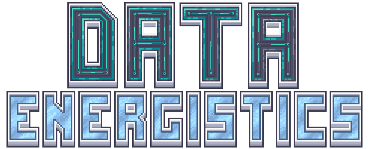

  

<h1 align="center">Data Energistics</h1>

  面向 Applied Energistics 2 网络的数据处理、自动化与大型合成扩展。 
  Data processing, automation, and large-scale crafting for Applied Energistics 2 networks.

  
  
  
  
  

  
  
  
  
  
  

  <a href="#简体中文">简体中文</a> · <a href="#english">English</a>

## 简体中文

### 项目简介

Data Energistics 围绕 AE2 网络扩展数据处理、资源存储、机器自动化与大型合成能力。项目包含数据流存储体系、数据机器、三位一体多方块合成系统，以及样板供应和终端等
AE2 网络扩展。

### 核心内容

- **数据流体系**：提供数据流元件、存储单元、便携存储和相关资源生产链。
- **数据机器**：包括数据重组、数据撕裂、数据拟生、能量与资源均分等自动化设备。
- **三位一体合成**：通过多方块数据核心、样板核心和接入结构处理大型、并行及循环合成计划。
- **AE2 网络扩展**：扩展样板供应、终端、虚拟输出和网络内的机器协作能力。
- **游戏内指南**：主要方块、机器和资源均接入 AE2 Guide，可在游戏内查看对应说明。

### 下载

| 渠道                                                                                 | 用途                                   |
|--------------------------------------------------------------------------------------|----------------------------------------|
| [CurseForge](https://www.curseforge.com/minecraft/mc-mods/data-energistics)          | 推荐下载渠道，提供正式发布文件         |
| [GitHub Releases](https://github.com/fish1145/DataEnergistics/releases)              | 正式版本归档、更新记录和发布附件       |
| [Latest Build](https://github.com/fish1145/DataEnergistics/releases/tag/latest-1.21) | 当前 `1.21` 分支的开发快照，仅用于测试 |

开发快照可能包含未完成改动，不保证稳定性或存档兼容性。重要世界升级前请先备份。

### 运行环境

| 项目       | 要求                           |
|------------|--------------------------------|
| Minecraft  | `1.21.1`                       |
| Mod Loader | NeoForge `21.1.216` 或更高版本 |
| Java       | `21`                           |
| 运行端     | 客户端与服务端                 |

安装时请从上述正式渠道下载与游戏版本匹配的文件，并将模组及发布页面列出的必需组件放入 `mods` 目录。多人游戏中，客户端与服务端应使用相同的
Data Energistics 版本。

### 文档与反馈

- 游戏内容：使用游戏内的 AE2 Guide。
- 扩展开发：[Data Energistics 3.0.x API 文档](docs/api/README.md)。
- 版本变化：[CHANGELOG.md](CHANGELOG.md) 与 [GitHub Releases](https://github.com/fish1145/DataEnergistics/releases)。
- 问题反馈：[GitHub Issues](https://github.com/fish1145/DataEnergistics/issues)。报告问题时请附上版本、日志和稳定复现步骤。

3.0.x 的兼容承诺只覆盖 API 文档中明确列出的公开边界。源码中的其他 `public` 类型不自动构成稳定 API。

### 许可证

- 除另有声明和第三方代码外，本项目自有代码采用 [GNU Affero General Public License v3.0 or later](LICENSE) 授权。
- 本项目自有非代码资源为 **All Rights Reserved**，具体范围和使用限制见 [LICENSE.RESOURCE](LICENSE.RESOURCE)。
- 第三方内容继续适用其原始许可证，详见 [THIRD_PARTY_NOTICES.md](THIRD_PARTY_NOTICES.md) 和对应文件声明。
- 代码与资源即使位于同一仓库或 JAR 中，仍分别适用各自许可证。

---

## English

### Overview

Data Energistics expands AE2 networks with data processing, resource storage, machine automation, and large-scale
crafting. It includes a Data Flow storage ecosystem, data-processing machines, the multiblock Trinity crafting system,
and AE2 network extensions for pattern providers and terminals.

### Highlights

- **Data Flow ecosystem**: Data Flow components, storage cells, portable storage, and their resource-production chain.
- **Data machines**: Automation for data reassembly, data ripping, mob simulation, energy distribution, and resource
  distribution.
- **Trinity crafting**: Multiblock data cores, pattern cores, and access structures for large, parallel, and cyclic
  crafting plans.
- **AE2 network extensions**: Pattern-provider, terminal, virtual-output, and networked machine-coordination features.
- **In-game guide**: Major blocks, machines, and resources are documented through the AE2 Guide.

### Downloads

| Channel                                                                              | Purpose                                                         |
|--------------------------------------------------------------------------------------|-----------------------------------------------------------------|
| [CurseForge](https://www.curseforge.com/minecraft/mc-mods/data-energistics)          | Recommended channel for stable release files                    |
| [GitHub Releases](https://github.com/fish1145/DataEnergistics/releases)              | Stable release archive, changelogs, and artifacts               |
| [Latest Build](https://github.com/fish1145/DataEnergistics/releases/tag/latest-1.21) | Development snapshot of the current `1.21` branch; testing only |

Development snapshots may contain unfinished changes and do not guarantee stability or world compatibility. Back up
important worlds before upgrading.

### Requirements

| Component   | Requirement                  |
|-------------|------------------------------|
| Minecraft   | `1.21.1`                     |
| Mod Loader  | NeoForge `21.1.216` or newer |
| Java        | `21`                         |
| Environment | Client and server            |

Download a file matching your game version from an official channel above, then place the mod and the required
components listed on its release page in the `mods` directory. Multiplayer clients and servers should use the same Data
Energistics version.

### Documentation and Support

- Game content: use the in-game AE2 Guide.
- Add-on development: [Data Energistics 3.0.x API documentation](docs/api/README.md).
- Release changes: [CHANGELOG.md](CHANGELOG.md)
  and [GitHub Releases](https://github.com/fish1145/DataEnergistics/releases).
- Bug reports: [GitHub Issues](https://github.com/fish1145/DataEnergistics/issues). Include versions, logs, and reliable
  reproduction steps.

The 3.0.x compatibility commitment covers only the public boundaries explicitly listed by the API documentation. Other
`public` source types are not automatically stable API.

### License

- Unless otherwise stated and excluding third-party code, project-owned code is licensed under
  the [GNU Affero General Public License v3.0 or later](LICENSE).
- Project-owned non-code resources are **All Rights Reserved**. See [LICENSE.RESOURCE](LICENSE.RESOURCE) for the
  applicable scope and restrictions.
- Third-party content remains under its original licenses. See [THIRD_PARTY_NOTICES.md](THIRD_PARTY_NOTICES.md) and the
  notices attached to individual files.
- Code and resources remain under their respective licenses even when distributed in the same repository or JAR.
