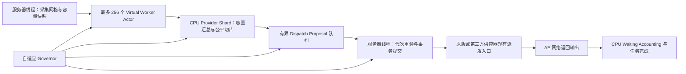

# Trinity CPU 高可用高并行合批发配架构

## 1. 文档状态

- 方案状态：Phase 0 至 Phase 5、VirtualGrid typed execution route、全服务器共享动态 tick 边界、
  自适应 Governor 与 SAFE 同步回退均已实现
- 适用范围：Trinity Data Core CPU、AE2 原版样板供应器以及可选模组自定义样板供应器
- 核心目标：在保留 256 份完整独立硬件资源、高容量和高并行的前提下，提高 CPU 选择、合批、容量切分、供应器发配和输出回收效率
- 本文档只负责“计划提交后的派发”架构；计算、循环配方和数量语义见
  `trinity-cpu-planning-and-cycle-architecture.md`
- 当前缺陷证据、修复映射和验证矩阵见 `trinity-cpu-calculation-audit-and-remediation.md`

## 2. 已确认需求

### 2.1 CPU 硬件语义

1. 一个 Trinity Data Core 最多发布 256 个 worker。
2. 每个 worker 都拥有完整存储容量、完整协处理器数量、独立任务、独立库存、独立等待输出和独立执行预算。
3. 256 个 worker 不是共享一份存储、协处理器或操作预算的资源池。
4. 除明确标记为共享的硬件或共享状态外，所有可用 CPU 都可以进入自动预选。
5. 网格级限流只限制昂贵的物理调用和服务器线程耗时，不得修改每个 worker 的硬件数值或逻辑合成能力。

### 2.2 CPU 与供应器职责

CPU 对以下行为负权威责任：

- CPU 候选预选和失败续选；
- 图样任务分组；
- 供应器和目标机器容量汇总；
- CPU 侧倍率计算；
- 按机器容量切分发配数量；
- 并行发配计划；
- 输入、能源和操作预算核算；
- 成功数量、任务进度、等待输出和回收归属记账；
- 公平轮询、退避、负缓存和自适应限流。

第三方样板供应器保持原有物理输入输出行为。针对第三方供应器的 Mixin 或兼容桥只允许提供只读信息，包括机器数量、机器身份、机器容量、在线状态、连接顺序和快照版本。兼容层不得把 CPU 的合批、切分、调度或回收算法注入供应器。

### 2.3 原版行为

以下 AE2 语义必须保持：

- Blocking Mode；
- `LOCK_UNTIL_RESULT`；
- `LOCK_UNTIL_PULSE`；
- `ICraftingMachine` 的单次计划接收语义；
- `sendList` 未清空时不得继续注入；
- 供应器和相邻目标的原有 round-robin；
- 供应器返回 `false` 时，未转移所有权的输入不得丢失；
- 供应器已经取得输入后即使抛出异常，也不得重复派发同一份输入。

## 3. 非目标

本方案不执行以下行为：

1. 不把 256 个 worker 合并成共享硬件资源池。
2. 不让异步线程直接修改 AE2 网格、世界、方块实体、能源或库存。
3. 不通过反射读取第三方供应器内部状态。
4. 不替换第三方供应器的 `pushPattern`、锁定、阻挡、内部队列、round-robin 或成品回传逻辑。
5. 不假定所有自定义供应器都支持原子合批或定向派发。
6. 不把所有 `pushPattern == false` 都解释为 Blocking。
7. 不以牺牲物品守恒、任务账本或重载恢复正确性换取吞吐量。
8. 不在本文档中定义循环配方求解、动态替代或最终产物 seed 保留；这些能力属于独立计算与循环轨道。

## 4. 术语

| 术语 | 定义 |
| --- | --- |
| worker | 一个独立的 `TrinityDataCoreVirtualCpu` 及其执行逻辑 |
| 逻辑 craft | 图样被执行一次对应的输入、输出和任务进度单位 |
| 物理调用 | CPU 对供应器或目标执行一次不可再拆分的真实提交 |
| 容量快照 | 服务器线程在某一代次读取的供应器及机器只读状态 |
| target | 供应器后方的一台可接收处理输入的机器或一个稳定路由目标 |
| dispatch slice | CPU 分配给一个目标的一段逻辑 craft 数量 |
| proposal | 异步规划线程生成、等待服务器线程校验和提交的发配提案 |
| provider shard | CPU 内部按供应器身份划分的规划和公平队列，不是供应器内部线程 |
| commit | 服务器线程执行的输入、能源、供应器调用和账本变更事务 |

## 5. 当前实现基线

当前 Trinity CPU 在 `CraftingServiceMixin.onServerEndTick` 中依次调用 runtime，并由 `TrinityDataCoreCpuLogic` 在服务器线程完成图样派发。

已有的正确基础包括：

- 每个虚拟 CPU 有自己的 `TrinityDataCoreCpuLogic`、库存、任务和 `usedOps`；
- CPU 操作预算按协处理器数量独立计算；
- `CountedCraftingAdmission` 已定义一次性提交和输入所有权边界；
- 批量任务进度、聚合 scheduled output 和实际接受数量之间已有一致记账规则；
- Blocking、结果锁、脉冲锁和专用 `ICraftingMachine` 已回退原版单次派发；
- 网格 tick 使用 worker ready queue、proposal completion handoff、按 tick retry queue 和共享 `CraftingDispatchWindow`，
  不再遍历无关 retained worker。

Phase 0 至 Phase 2 已补齐：

- 完整 CPU 候选收集、busy/offline/too-small 失败续选；
- 同规格 CPU 的负载排序、成功后轮询和 provider 惰性迭代；
- 明确的拒绝原因、provider/target 本 tick 负缓存；
- 网格、provider 和 worker 物理调用预算；
- 服务器提交时间预算与供应器准备/提交作用域核算。

VirtualGrid 的 P0 身份缺口已通过 typed execution route 修复。`TrinityCraftingExecutionRoute` 同时绑定物理
`owningGrid`、实际提供 crafting/storage/energy 服务的 `serviceGrid`、access lease epoch 和 virtual membership
generation。CPU 发布、提交、在线判定、状态菜单和输出路由统一使用 `serviceGrid`；`connectedGrid()`、`accessGrid()`、
信息交换仓选举和物理租约仍保留 owning grid 语义。inactive、未注册或代次不匹配的虚拟成员不产生可执行路由，旧菜单
目标与后续 proposal 因完整 route token 不匹配而失效。

Phase 3 同步容量路径现已接入：

- `CraftingService` 维护不推进 AE2 round-robin 的 provider publication index，重注册会获得新 identity；
- CPU 只为当前 ready work 从库存副本捕获一次输入 prototype，容量枚举不会提前修改真实库存；
- `ProviderCapacityResolver` 在准备前重验 publication revision、counted capability revision、pattern identity 和 target route；
- `CapacitySlicePlanner` 使用跨 tick 稳定 cursor 选择 target，失败 target 不会吞掉同 tick 后续 provider 的机会；
- 每个物理调用统一经过 `CraftingDispatchCommitter`，拒绝和所有权前异常计入 attempt，只有实际成功数量进入任务、waiting、能源和输入账本；
- 无法证明定向或 counted 语义的 AE2 子类及 addon 路线统一降级为 `UNKNOWN` 单次提交，不绕过其 `pushPattern` hook。

仍未实现的部分为：

| 阶段 | 当前缺口 | 优先级 |
| --- | --- | --- |
| Phase 3 | 已完成：publication identity、同步容量快照、独立 4 ms 采集预算、公平切片、保守 addon 路由和唯一 commit | 已完成 |
| Phase 4 | 已完成 worker mailbox、bounded proposal queue、generation/stale 校验、事件驱动 worker queue、固定 provider shard 与 machine reservation | 已完成 |
| Phase 5 | 已完成长期指标窗口、`OBSERVING`/`ADAPTIVE`/`SAFE` Governor、独立配置和同步安全回退 | 已完成 |

计算入口、样板图、SCC/MIP 和循环执行不依赖上述 Phase 3 至 Phase 5，可在保持服务器线程事务边界的前提下作为独立轨道推进。

### 5.1 当前代码职责布局

```text
common.crafting.trinity
├─ dispatch
│  ├─ selection   CPU 候选选择
│  ├─ model       派发状态和值类型
│  ├─ budget      固定物理预算
│  ├─ capacity    provider 容量捕获、重验与公平切片
│  ├─ commit      同步窗口与一次准入结果
│  └─ provider    publication index 与 counted provider 契约
├─ execution.cpu  CPU runtime、worker、job 与派生索引
├─ execution.route owning/service grid、lease 与 virtual membership 路由令牌
├─ execution      admission、pattern、runtime transaction 与持久状态机
├─ planning       graph、gateway、plan 与算法
│  └─ algorithm.cycle
│     ├─ deterministic
│     └─ mip
├─ profile        CPU 硬件配置值
└─ status         菜单同步 DTO
```

Phase 3 至 Phase 5 实施时只新增 `dispatch.provider`、`dispatch.capacity`、`dispatch.commit`、`dispatch.async` 和
`dispatch.governor` 等明确职责包，不把新逻辑
继续堆入 `CraftingServiceMixin` 或 `TrinityDataCoreCpuLogic`。

## 6. 总体架构



整体采用“只读快照、异步规划、服务器线程提交”的双阶段模型：

1. 服务器线程生成不可变网格快照和供应器容量快照。
2. 每个活跃 worker 的 Virtual Actor 根据自身完整硬件预算生成任务候选。
3. CPU 内部 provider shard 汇总对相同供应器和目标的竞争，生成公平切片。
4. proposal 进入有界队列，防止异步规划无限领先于服务器提交。
5. 服务器线程重新验证代次、容量、阻挡、锁定、输入、能源和等待输出。
6. 服务器线程执行真实派发并只提交实际成功的账本变更。
7. 自适应 Governor 根据 TPS、队列和失败率调整物理调用额度、提交时间、Actor permit、provider quantum、队列高水位和退避。

## 7. 线程模型

### 7.1 Virtual Worker Actor

每个已发布 worker 拥有独立逻辑 Actor：

- mailbox 只接收不可变快照、任务摘要和控制消息；
- Actor 只计算候选、排序、容量上限和 proposal；
- Actor 不持有可跨 tick 使用的世界、网格、方块实体或供应器可变引用；
- 空闲 worker 保留身份和调度游标，但可以挂起，不持续占用运行线程；
- 正常 work 提交、拒绝或 stale 只释放该 exact work identity 的 proposal；worker 生命周期变化、取消或异常隔离才清理全部 slots，
  记录完整上下文后允许下一 tick 重建规划状态。

Virtual Actor 不等于每个 worker 拥有一个长期占用的操作系统平台线程。实现应使用受控虚拟线程执行器或等价的有界调度设施，禁止为每个图样或每次自动请求无界创建线程。

### 7.2 服务器线程边界

以下操作只能在服务器线程执行：

- 枚举 AE Grid 和 crafting provider；
- 读取目标机器实时容量；
- 校验方块实体、维度、连接和租约；
- 提取或返还 CPU 输入；
- 模拟或扣除能源；
- 调用 `pushPattern` 或其它现有物理派发入口；
- 更新任务进度、waiting output、CPU inventory 和 NBT 脏状态；
- 修改 Blocking、Lock、Pulse 或供应器 round-robin 所依赖的原有状态。

### 7.3 快照生命周期

每份快照至少携带：

- Grid 身份和 generation；
- runtime 身份和 generation；
- worker 身份和任务 revision；
- provider 稳定身份和 revision；
- target 稳定身份和 capacity revision；
- 快照 tick。

网络重建、供应器移除、机器卸载、维度卸载、访问租约变化、样板目录重发或任务变化后，旧 proposal 必须被服务器线程判定为 `STALE`，不得按旧容量提交。

proposal 只能携带不可变身份、数量和版本，不能携带已经准备好的 `CountedCraftingAdmission`、已提取输入、能源预扣或第三方可变引用。admission 只能由服务器线程在真实物理提交前准备，并在同一 tick、同一同步调用链中完成一次性 commit。proposal 可以跨 tick 等待，但提交前必须重验 grid/runtime/worker/job/work/route/provider/pattern/target 的完整身份与代次；任一不匹配即释放并重新规划。

同一 worker 可以为多个依赖无关的 work identity 保留独立 proposal slot。当前 work 的 outstanding、release 和 stale 判定必须按
identity 精确执行；worker 级 aggregate outstanding 只用于调度快照和等待事件，不能回填到另一个已经 committed 的 slice。
当前提交成功只关闭自己的 ticket 与 reservation，其它 work 继续保留到各自的服务器线程结算边界。

## 8. CPU 预选策略

### 8.1 候选范围

自动选择必须收集完整候选列表，而不是只取第一个可见 CPU：

```text
在线
  -> SelectionMode 允许当前来源
  -> 非共享候选
  -> 存储容量满足 job.bytes
  -> 当前未忙碌
  -> 加入预选
```

原版 CPU、Trinity 虚拟 CPU 和明确支持 AE2 选择语义的外部 CPU 可以进入同一候选排序，但不得把外部模组未知 CPU 当作 Trinity 硬件的一部分。

### 8.2 排序

候选排序依次考虑：

1. `PLAYER_ONLY`、`MACHINE_ONLY` 和 `ANY` 对当前来源的偏好；
2. 用户请求的 `prioritizePower`；
3. 当前任务数和最近操作负载；
4. 同规格 CPU 的成功后 round-robin 游标；
5. 稳定身份作为最终确定性顺序。

同规格 CPU 不按集合迭代顺序长期固定选择第一座。

### 8.3 失败续选

预选后按顺序尝试提交：

- `CPU_BUSY`：尝试下一候选；
- `CPU_OFFLINE`：尝试下一候选，并令对应 runtime 快照失效；
- `CPU_TOO_SMALL`：尝试下一候选；
- 缺少原料：返回真实缺料结果，不盲目在其它 CPU 重复提取；
- 成功：推进同规格 round-robin 游标；
- 所有候选失败：返回最有诊断价值且不会掩盖原版结果的错误。

## 9. 第三方供应器只读容量协议

### 9.1 接口边界

兼容层采用面向接口的只读契约。当前实现由以下职责组成：

```java
interface ProviderCapacityView {
    List<ProviderCapacitySnapshot> snapshotCapacity(
            CraftingProviderId providerId,
            IPatternDetails patternDetails,
            KeyCounter[] prototype,
            long requestedCrafts,
            String patternIdentity,
            long publicationRevision,
            long capacityRevision,
            long captureTick);
}

record ProviderCapacitySnapshot(
        CraftingProviderId providerId,
        CraftingDispatchTarget route,
        Optional<MachineTargetId> machineTargetId,
        String patternIdentity,
        long publicationRevision,
        long capacityRevision,
        long captureTick,
        ProviderRoutingMode routingMode,
        DispatchCapacity capacity,
        DispatchCapacity maximumSingleBatch) {
}
```

`ProviderCapacityResolver` 从 publication index 捕获快照并在提交前解析 live provider；接口实现只负责把供应器已经掌握的事实转换成不可变快照，不负责选择倍率或产生发配动作。

### 9.2 允许读取的信息

- 有效连接机器数量；
- 稳定机器身份，例如维度、位置、方向或第三方连接 ID；
- 连接和路由顺序；
- 机器是否在线、加载、忙碌或处于冷却；
- 当前图样可接受的逻辑 craft 数量；
- 供应器内部尚未清空的输入、溢出或回收队列是否阻止继续派发；
- 输出回收空间或现有 API 能可靠提供的回收容量；
- 容量或连接变化 revision。

### 9.3 禁止行为

第三方兼容 Mixin 不得：

- 修改 `pushPattern` 的输入、输出或返回值；
- 修改目标选择或 round-robin；
- 修改机器库存或供应器发送队列；
- 修改 Blocking、Lock、Pulse 或红石行为；
- 修改供应器返回库存；
- 替第三方供应器增加新的合批提交语义；
- 使用反射、`MethodHandle` 或 `VarHandle` 扫描第三方私有字段；
- 在异步线程读取第三方方块实体或集合。

若模组没有稳定、可验证的容量信息入口，该模组必须退回保守容量，不允许猜测私有状态。

### 9.4 路由能力

CPU 需要区分供应器现有入口能表达的路由能力：

| 路由能力 | CPU 行为 |
| --- | --- |
| `TARGETED` | 使用第三方已经公开的定向入口，按 target slice 精确提交 |
| `ORDERED` | CPU 按只读快照给出的稳定路由顺序提交，供应器使用自己的既有顺序接收 |
| `AGGREGATE` | 供应器现有入口只接受聚合数量，CPU提交聚合输入但保留 target 级账本计划 |
| `UNKNOWN` | 容量按 1 处理并保持单次派发 |

只读容量信息不能凭空创建第三方不存在的定向派发 API。若供应器没有公开定向入口，CPU 可以决定总量和提交顺序，但不能声称精确指定某个内部目标。

## 10. CPU 倍率和容量切分

### 10.1 容量上限

对某个 worker、图样和供应器，CPU 计算：

```text
taskLimit       = 任务剩余逻辑 craft 数
inputLimit      = CPU 库存可提供的逻辑 craft 数
energyLimit     = 当前能源可支持的逻辑 craft 数
waitingLimit    = scheduled output / waiting output 可容纳数量
operationLimit  = 该 worker 独立协处理器预算
machineLimit    = 所有可用目标的 craftCapacity 之和
providerLimit   = 供应器现有队列、锁定或入口限制
gridLimit       = 当前网格剩余物理时间/调用额度能承载的逻辑数量

dispatchCount = min(
    taskLimit,
    inputLimit,
    energyLimit,
    waitingLimit,
    operationLimit,
    machineLimit,
    providerLimit,
    gridLimit)
```

所有乘法、加法和容量汇总必须使用精确或饱和运算，禁止 `long` 溢出后得到负容量。

### 10.2 让所有机器优先运行

容量切分不能简单地先填满第一台机器，否则任务数量少于总容量时，后面的机器长期不启动。

采用“启动优先的最大最小公平切分”：

1. 从 provider 的持久 round-robin 起点开始枚举在线且容量大于 0 的机器。
2. 当 `dispatchCount` 足够时，先给每台可用机器分配 1 份。
3. 剩余数量按 round-robin 继续逐层填充，任何机器不得超过自己的 `craftCapacity`。
4. 成功提交后推进 target 游标；失败目标不吞掉后续目标的机会。
5. 同一机器连续报告容量 0 时可以退避，但下一份新 revision 必须允许它重新加入。

示例：

```text
机器容量：[4, 4, 2, 8, 0, 1]
dispatchCount = 12

第一轮启动：[1, 1, 1, 1, 0, 1]
继续公平填充后，可得到：[3, 3, 2, 3, 0, 1]
```

若 `dispatchCount = 19`，最终分配为全部容量 `[4, 4, 2, 8, 0, 1]`。

### 10.3 倍率定义

本方案中的 CPU 翻倍不是永久改写样板，也不是让供应器自行决定倍率。

```text
CPU 倍率 = 本次 CPU 计划并成功派发的基础逻辑 craft 数
```

对于已由其它模组包装或缩放的 `IPatternDetails`，CPU 必须同时保留：

- pattern 自身表达的一次逻辑输入和输出；
- CPU 本轮实际派发次数。

账本总量始终是：

```text
pattern 单次输入/输出 × CPU 实际成功数量
```

不得把已经聚合的 synthetic pattern 再乘一次相同 count，避免 `N²` 输入或输出记账。

## 11. 合批和发配模式

CPU 根据能力选择三种模式：

### 11.1 原子计数合批

适用于原版普通外部库存路径、本模组三位一体信息交换仓以及明确具有一次性 admission 契约的路径。

- 一次物理调用承载多个相同逻辑 craft；
- preparation 固定目标和接受数量；
- commit 最多调用一次；
- 返回 `false` 前不得消费输入；
- 输入所有权转移后发生异常时按完整 admission 已派发处理。

第三方 provider 通过 `DataEnergisticsPlugin` 的统一 registry 声明稳定 provider 身份与 counted adapter factory。
服务端在 provider publication 生命周期内完成实例绑定和解绑；CPU 始终按“冻结插件 registry 精确匹配的
adapter、DataEnergistics 直接 counted 契约、AE2 普通单次”顺序解析。绑定、只读 preparation 及一次性
commit 都属于服务器线程同步发配边界，公共适配器不暴露 target、窗口、规划或容量切片内部类型。

### 11.2 CPU 容量切片发配

适用于能够提供只读机器容量、但不提供原子计数 admission 的自定义供应器。

- CPU 计算总量和 target slices；
- CPU 使用供应器已经存在的物理入口提交；
- 每个 slice 单独记录成功数量；
- 部分成功允许保留，未成功部分回滚并重新规划；
- 第三方供应器不获得新的合批逻辑。

### 11.3 保守单次发配

适用于：

- Blocking Mode；
- `LOCK_UNTIL_RESULT`；
- `LOCK_UNTIL_PULSE`；
- `ICraftingMachine`；
- Applied Create 或其它无法证明原子性的路径；
- 未识别供应器；
- 容量快照不完整、过期或路由能力未知的供应器。

单次路径仍参与 CPU 公平轮询和物理预算，但不得被通用合批逻辑绕过。

### 11.4 跨 worker 合批边界

首个可用版本只允许 worker 内部合批。不同 worker 的任务、输入库存、scheduled output 和 waiting output 继续独立提交。

跨 worker 二级合批只有在以下条件全部具备后才能单独启用：

- 每个贡献 worker 的输入、能源、任务和输出份额可独立验证；
- provider 对整个聚合提交具有明确原子性；
- 部分成功能够准确映射回贡献切片；
- 任意异常都不会造成一个 worker 成功、另一个 worker 被错误回滚；
- 已完成专项逻辑测试、GameTest 和重载测试。

该能力不属于阶段 1 至阶段 4 的默认交付，不得为了减少物理调用提前混入基础调度改造。

## 12. Provider Shard

provider shard 是 CPU 内部的规划结构，用于处理多个 worker 对同一供应器或同一目标的竞争。

### 12.1 分片规则

- 使用 provider 稳定身份进行一致分片；
- 同一 provider 的 proposal 进入同一 shard；
- 同一 target 不允许在同一 generation 被两个 shard 重复预留容量；
- shard 数量固定为 16，Governor 不得在运行中调整，避免 live remap；
- shard 只处理不可变快照和 reservation，不持有世界对象。

### 12.2 公平性

每个 shard 使用分层轮询：

1. Grid round-robin；
2. runtime round-robin；
3. worker deficit round-robin；
4. provider priority 和 round-robin；
5. target 启动优先的最大最小公平切分。

单个超大 worker、供应器或图样不能长期独占网格物理提交额度。

### 12.3 容量预留

容量预留只存在于 CPU proposal 层：

- 预留不修改供应器和机器；
- 预留绑定 provider revision 和 target revision；
- proposal 被拒绝、过期或取消时立即释放；
- 服务器线程提交后以实际成功数量结算；
- 预留不能跨重载持久化。

## 13. 服务器线程事务

### 13.1 提交顺序

每个 proposal 在服务器线程按以下顺序处理：

1. 校验 Grid、runtime、worker、job、provider 和 target 身份。
2. 校验所有 generation 和 revision。
3. 重新读取 Blocking、Lock、busy、连接和容量状态。
4. 计算本次仍可接受的实际数量，必要时缩小 slice。
5. 校验 scheduled output 和 waiting output 容量。
6. 提取或预留输入。
7. 模拟并扣除能源。
8. 获取网格和供应器物理调用额度。
9. 调用现有物理派发入口。
10. 根据输入所有权和返回结果判定实际成功数量。
11. 提交任务进度、scheduled output、waiting output 和 worker 操作数。
12. 回滚未派发输入、未消耗能源和未使用 reservation。

### 13.2 部分成功

CPU 容量切片允许部分成功：

```text
计划 19
成功 12
第 13 份因容量变化被拒绝

结果：
- 任务进度只减少 12
- waiting output 只增加 12 份输出
- 能源只消耗 12 份
- 已成功的 12 份不回滚
- 剩余 7 份留在任务中等待重新规划
```

### 13.3 输入所有权

必须保持一次性所有权边界：

- 供应器未修改输入 holder 且返回 `false`：本次未派发，可回滚；
- 供应器已经取得输入：本次按已派发记账；
- 供应器取得输入后返回 `false` 或抛异常：记录错误并按已派发处理，避免复制；
- 供应器在取得输入前抛异常：回滚本次和未使用资源，将供应器标记为当前窗口不可用；
- 核心业务异常必须隔离并记录日志，不能使用空 `catch`，也不能因一个供应器故障崩溃整个服务器进程。

## 14. Blocking、Lock 和拒绝原因

发配结果应使用明确状态，而不是只传播布尔值：

```text
ACCEPTED
BLOCKED
LOCKED
BUSY
OFFLINE
NO_CAPACITY
STALE
REJECTED
FAILED_BEFORE_OWNERSHIP
FAILED_AFTER_OWNERSHIP
```

处理规则：

- `BLOCKED`：按 provider + target/方向加入本 tick 负缓存；
- `LOCKED`：供应器在原版锁解除前不再进入候选；
- `BUSY`：当前轮跳过，可在状态 revision 变化后重新加入；
- `NO_CAPACITY`：当前容量 generation 不再尝试该 target；
- `STALE`：释放 reservation 并重新规划；
- `REJECTED`：不自动等同于 Blocking；
- `FAILED_BEFORE_OWNERSHIP`：回滚并隔离当前供应器窗口；
- `FAILED_AFTER_OWNERSHIP`：按成功记账并输出高严重度日志。

负缓存最多持续当前 tick 或当前容量 revision。下一 tick 或 revision 变化后必须重新检查，确保机器解除阻挡后自动恢复。

## 15. 物理预算和自适应 Governor

### 15.1 两类预算

必须区分：

- 逻辑预算：每个 worker 按自身完整协处理器计算，可通过合批在一次物理调用中完成大量逻辑 craft；
- 物理预算：每网格、每 provider 和每服务器 tick 允许执行的真实调用与时间。

物理预算耗尽时，未提交 proposal 延后到下一 tick，不丢失、不取消 worker 的逻辑硬件能力。

所有 Grid 的容量捕获与 provider 提交共享同一个服务器 tick 边界。边界从上一完整 tick 中扣除已记录的
Trinity 发配耗时，以剩余的非 Trinity 基线估算可用余量：基线低于 `50 ms` 时只使用到 `50 ms` 的余量；
基线已经达到或超过 `50 ms` 时仍保留 `1 ms/tick` 的同步发配通道。已经开始的同步 provider 调用必须完成
所有权结算，但边界耗尽后不再启动后续物理调用。预算耗尽是可重试状态，不计为 stale 或 provider 拒绝。

### 15.2 观测指标

Governor 至少观测：

- 服务器 tick 耗时和最近 TPS；
- 快照采集耗时；
- 异步规划耗时；
- 服务器提交耗时；
- proposal 队列长度、outstanding 数量和单调时钟等待耗时；
- stale 比例；
- provider/target 接受率；
- 每物理调用承载的逻辑 craft 数；
- Blocking、Lock、容量不足和异常计数；
- 每 worker 获得的提交份额。

### 15.3 可调参数

Governor 可以调整：

- 活跃规划 Actor permit；
- proposal 高水位；
- 每网格物理调用额度；
- 每 provider 每轮 quantum；
- 单 tick 服务器提交时间预算；
- stale proposal 的重算频率；
- 长期容量为 0 的 target 退避时间。

固定 16 个 shard、executor 物理队列容量和 counted logical batch 不属于 Governor 可调参数。

调整必须渐进，避免因为单 tick 波动频繁切换模式。当前 COMMON 配置以 hard `256/16/30 ms`、safe
`16/2/2 ms`、SAFE retry backoff `8 tick`、`200 tick` warm-up、`20 tick` 窗口和 `0.25` EWMA alpha
作为已确定初值；后续压力矩阵只允许
在不破坏 hard/safe 不变量的前提下重新校准。

运行时状态机已经启用：`OBSERVING` 只采集窗口并使用 hard budget；`ADAPTIVE` 在连续 3 个窗口满足高负载或恢复
条件后按固定步长调节物理调用、提交时间、Actor permit、provider quantum、proposal 高水位和 retry backoff；调整后
保持 60 tick cooldown。连续 3 个原始服务器 tick 超过 `100 ms`，或 proposal/Actor/Governor 出现未预期异常时立即进入
`SAFE`，取消瞬态 proposal 并改走 safe budget 的 Phase 3 同步提交；保持 200 tick 后重新进入 `OBSERVING`。该切换不写
作业 NBT，也不改变 counted logical batch。

阶段 2 的固定安全模式依据 Phase 0 已记录的 7 个 256 Worker 样本，将服务器提交时间预算暂定为
`30,000,000 ns`；样本最大值为 `26,108,000 ns`。该预算测量供应器准备和真实提交作用域，耗尽后只延后未提交
任务。它不是最终 Governor 默认值，阶段 5 必须通过完整压力矩阵重新校准。

### 15.4 降级

出现以下情况时按局部范围降级：

- 容量快照失败：该 provider 退回单次；
- provider revision 高频变化：缩短 proposal 生命周期或暂时在服务器线程同步规划；
- proposal 队列积压：减少异步并行和物理额度；
- 某 provider 高频异常：只隔离该 provider，不停止其它 worker；
- Governor 自身异常：回到固定安全额度和服务器线程单次路径。

降级不得改变输入、输出、Blocking、Lock 或任务账本语义。

## 16. 输出回收和任务归属

第三方供应器继续使用其现有物理返回方式把成品送回 AE 网络或返回库存。CPU 负责逻辑回收归属：

1. 每个成功 slice 按实际成功数量登记预期输出。
2. waiting accounting 保持 worker 和 job 级独立。
3. 返回物进入 crafting service 后，只能抵扣已经登记的 waiting output。
4. 重复输出 Key 必须先聚合再记账，不能因同一图样多个输出槽重复扣减。
5. 多个 worker 等待相同 Key 时遵循现有 CPU 插入和公平顺序，不允许某个 worker 消耗超过自己的等待量。
6. 任务取消、CPU 离线、结构失效和服务器重载必须继续使用现有持久化与退款语义。

CPU 不要求第三方供应器为物品附加 worker 标签，也不修改第三方返回库存格式。

## 17. 兼容策略

| 供应器类别 | 容量来源 | CPU 模式 | 备注 |
| --- | --- | --- | --- |
| AE2 精确原版 `PatternProviderLogic` | 原版 target 模拟和现有 accessor | `TARGETED` counted 切片 | Blocking/Lock/专用机器回退单次 |
| 三位一体信息交换仓 | 本模组目录和一次性 admission | `TARGETED` counted 切片 | 保留目录身份与所有权边界 |
| 本模组自适应样板供应器普通路线 | 原版 target 模拟和现有 accessor | `TARGETED` counted 切片 | 特殊 addon 路线不复用普通语义 |
| 公共 API 直接或注册的 counted provider | provider 自身 admission | `AGGREGATE` counted | API 保持软依赖，不暴露内部 target 类型 |
| AE2 `PatternProviderLogic` 子类、ExtendedAE Plus 与自适应特殊 addon 路线 | 无完整编译期定向契约 | `UNKNOWN` 单次 | 保留真实 `pushPattern` hook、内部顺序与回收语义 |
| AdvancedAE / ExtendedAE / AE2CS / AE2LT 其它路线 | 无已证明等价的容量契约 | `UNKNOWN` 单次 | 不按类名猜测原子性或 target 身份 |
| Applied Create | 可验证信息有限 | 保守单次 | 不假设机械网络原子接收 |
| 未识别供应器 | 无可靠快照 | 保守单次 | 正确性优先 |

每个可选模组适配器必须单独证明：

- 容量定义与逻辑 craft 单位一致；
- 快照读取没有副作用；
- target 身份稳定；
- revision 能覆盖连接和容量语义变化；
- 使用现有派发入口不会绕过阻挡、锁定和回收；
- 模组缺失时类加载安全。

## 18. 建议代码边界

### 18.1 现有文件

- `mixin/core/CraftingServiceMixin.java`
  - CPU 完整预选、失败续选、网格快照入口和服务器提交调度。
- `common/crafting/trinity/TrinityDataCoreCpuLogic.java`
  - worker 任务摘要、输入/能源/账本事务和实际成功数量提交。
- `common/crafting/trinity/CraftingDispatchWindow.java`
  - 从固定尝试计数扩展为物理预算、拒绝原因、负缓存和公平 quantum。
- `ae2/PatternProviderBatching.java`
  - 保留已证明安全的原子计数合批，不承载第三方供应器调度策略。
- `mixin/core/PatternProviderLogicMixin.java`
  - 保持原版必要桥接；第三方子类继续保守回退，不能在这里加入机器切分算法。

### 18.2 新逻辑层

建议在 `common/crafting/trinity/dispatch/` 下建立小型接口和实现，避免继续扩大 `TrinityDataCoreCpuLogic`：

| 接口/数据对象 | 职责 |
| --- | --- |
| `CapacitySlicePlanner` / `CapacitySlicePlannerImpl` | 根据不可变容量快照生成有界、公平的同步 slices |
| `ProviderCapacityResolver` / `ProviderCapacityResolverImpl` | 从 publication index 捕获快照并在提交前重验 live provider 与 revision |
| `CraftingDispatchCommitter` / `CraftingDispatchCommitterImpl` | 服务器线程重验和提交事务 |
| `CraftingDispatchGovernor` / `CraftingDispatchGovernorImpl` | 根据指标调整安全参数 |
| `ProviderCapacityView` | 第三方供应器只读容量入口 |
| `ProviderCapacitySnapshot` | provider、pattern 与 target 绑定后的不可变容量数据 |
| `CraftingDispatchProposal` | 绑定版本的待提交计划 |
| `CraftingDispatchSlice` | 一个 target 的计划数量 |
| `CraftingDispatchResult` | 明确成功数量、所有权和拒绝原因 |

接口实现类只在自己的装配边界使用。大对象应采用 Builder，禁止把所有规划、提交、指标、兼容和线程生命周期继续塞入一个超级对象。

### 18.3 第三方兼容层

每个可选模组按实际能力选择 `CountedCraftingProviderAdapter`、`ProviderCapacityView` 或等价只读桥：

- 使用编译期类型、公开 API、Mixin `@Accessor` 或只读 `@Invoker`；
- 不使用反射；
- 不修改第三方供应器字段；
- 不接管第三方 tick；
- 不改变第三方方法返回值；
- 兼容失败时记录日志并返回“不支持容量快照”，由 CPU 退回单次。

第三方推荐使用 `compileOnly` 引用 DataEnergistics API，并在模组元数据中声明 optional dependency。所有
DataEnergistics 类型只能出现在独立 compat 启动类中，调用方确认 DataEnergistics 已加载后才加载该类；原始
provider 类不得实现或引用这些类型。这样 DataEnergistics 缺失时 JVM 不会链接 compat 类，基础 provider
仍可正常加载。注册句柄应随 provider 的服务器端生命周期关闭；同一身份重复注册和重复注销均立即报错。

## 19. 分阶段实施

### 阶段 0：建立行为基线（已完成）

- 固化 256 worker 独立硬件不变量；
- 增加 CPU 候选选择、Blocking、Lock、round-robin 和批量账本的直接逻辑测试；
- 记录当前大网络的物理调用数、派发数量和 tick 耗时；
- 不修改第三方供应器行为。

### 阶段 1：CPU 预选和公平性（已完成）

- 修复满载 Data Core 自动预选；
- 建立完整候选列表和 `CPU_BUSY` / `CPU_OFFLINE` 续选；
- 同规格 CPU 按负载和成功 round-robin；
- 修复 provider 迭代器消费导致的轮询问题。

### 阶段 2：拒绝原因和物理窗口（已完成）

- 扩展 `CraftingDispatchWindow`；
- 增加 provider + target 本 tick 负缓存；
- 区分 Blocking、Lock、No Capacity 和普通拒绝；
- 引入网格物理调用和服务器提交时间预算。

### 阶段 3：只读容量协议和 CPU 切片（已完成）

- 已建立 provider publication identity/index、`ProviderCapacityView`、`TargetedCountedCraftingProvider` 和不可变容量值类型；
- 已实现 `CapacitySlicePlanner` 的稳定 cursor、启动优先最大最小公平切分和 `BigInteger` 数量边界，slice 数只受物理调用额度约束；
- 已将 `CraftingDispatchCommitter` 接入 Trinity 同步 provider 主路径，统一物理 attempt、输入所有权判定和一次性账本结算；
- 已接入 ready work 的服务器线程惰性快照、只读输入 prototype、提交前 revision/route 重验和稳定 cursor 路由；
- 已支持 AE2 精确原版 provider、三位一体信息交换仓和 Adaptive 普通路线的 `TARGETED` counted 切片；公共 counted API 使用 `AGGREGATE`；
- 已将 AE2 provider 子类及无法证明语义等价的 addon 路线显式降级为 `UNKNOWN` 单次，ExtendedAE Plus 不会绕过真实 hook；
- 已增加独立每网格 4 ms 容量采集预算，覆盖只读 prototype 构造和 provider 容量模拟；该预算与 30 ms commit 预算分别计量；
- 供应器兼容层不加入任何写行为。

### 阶段 4：Virtual Worker Actor 和 Provider Shard（已完成）

- 已把 provider target 选择迁移到只接收不可变快照的独立固定有界 executor；
- 已建立全局 1024、单 Grid 256、每 worker 受 Grid actor permits 约束且按独立 work identity 分槽的 proposal admission；
- 已建立 route/job/work generation lease、取消/暂停/重载清理和服务器线程 provider/输入/能源/账本重验；
- 已用 worker ready queue、proposal completion handoff 与 retry priority queue 替换 retained worker 全扫描；
- 已按 provider 稳定身份固定映射到 16 个 shard，同 provider route 的并发 proposal 共享容量预留；
- 已增加跨 provider 的 `MachineTargetId` 独占 reservation，并将释放生命周期绑定到 proposal ticket；
- 已将 committed/rejected/stale proposal 的释放绑定到 exact work identity；worker aggregate outstanding 不参与单个 slice 状态；
- worker/队列/Grid admission 压力只触发有界退避，不在被拒绝的同一轮绕过异步上限执行同步资源提交；
- worker round-robin、稳定 pattern work 顺序和 capacity target cursor 共同保留分层公平性，shard 只负责原子竞争边界；
- 保持所有真实世界提交在服务器线程。

### 阶段 5：自适应 Governor（已完成）

- 已增加独立 `data_energistics-trinity_dispatch.toml`，配置 hard/safe 物理预算、warm-up、指标窗口、
  EWMA、切换确认、cooldown、SAFE retry backoff 和 SAFE 保持时间；
- 已按 Grid 采集完整服务器 tick、容量捕获、proposal 排队/计算、服务器提交、接受率、stale、
  logical-per-physical-call、队列深度/outstanding 和 worker share；
- 已将 `OBSERVING`、`ADAPTIVE` 和 `SAFE` Governor 接入唯一 Grid dispatch window；配置重载只替换瞬态派生状态，
  不写作业 NBT；
- 已将所有 Grid 的 capacity/commit 时间接入同一服务器 tick 动态余量；低负载使用到 `50 ms` 目标，高负载保留
  `1 ms/tick`，避免每个 Grid 独立放大时间预算；
- 固定 16 个 shard；只自适应调整物理调用额度、提交时间、Actor permit、provider quantum、队列高水位和退避；
- 不拆小 counted logical batch；
- 已启用连续窗口确认、cooldown、异常隔离和固定 `SAFE` 同步模式；SAFE 结束后重新执行观察期；
- fake-metrics 契约覆盖观察、降档、恢复和 SAFE；全服务器预算契约继续保证非 Trinity 基线达到 `50 ms` 时仍只保留
  `1 ms/tick` 发配通道，且不使用墙钟 CI 断言。

阶段之间必须串行验收。不得在 CPU 账本、所有权和原版阻挡语义未稳定前直接启用异步规划或自适应切换。

## 20. 测试策略

### 20.1 纯逻辑测试

直接调用目标代码验证：

- 候选过滤、排序和失败续选；
- 256 个 worker 硬件预算彼此独立；
- 容量汇总的溢出边界；
- 启动优先切分保证所有有容量机器尽可能运行；
- task/input/energy/waiting/operation/machine 多重上限；
- provider shard reservation 不重复；
- stale proposal 被拒绝；
- 部分成功只按实际数量记账；
- 已聚合 synthetic pattern 不发生 `N²` 扣减；
- Governor 调整不突破硬上限。

禁止源码文本包含测试、反射测试和仅验证某功能已删除的测试。

### 20.2 集成测试

使用接口实现的可控 fake provider 和 fake capacity view，验证：

- 多 worker 竞争同一 provider；
- 多 provider 连接相同机器类型；
- 容量在 snapshot 和 commit 之间缩小；
- provider 部分接受后拒绝；
- 所有权转移前后分别抛异常；
- Blocking、Lock、Pulse 和 busy 状态变化；
- 输出回收顺序不同但总量守恒；
- provider 卸载、revision 变化和 proposal 取消。

### 20.3 GameTest

至少覆盖：

- 256 worker 同时存在且各自可以接受独立任务；
- 多台相同机器容量不一致时全部尽可能启动；
- 原版 Blocking 已有输入时不重复注入；
- `LOCK_UNTIL_RESULT` 和 `LOCK_UNTIL_PULSE` 成功后锁定并正确解锁；
- 自定义供应器容量快照只读，不改变其原有队列和轮询；
- 重载、区块卸载、网络断开和 Data Core 结构失效；
- 任务取消和退款；
- item、fluid、Data Key 和重复输出 Key；
- 服务器线程断言，确保世界写操作没有发生在 Virtual Actor。

### 20.4 性能验证

建立可重复场景，至少记录：

- 1、16、64、256 worker；
- 1、16、64、256 个目标机器；
- 单一图样热点和多图样混合；
- 普通合批、CPU 容量切片和保守单次；
- 空闲、满载、持续 Blocking 和持续容量变化；
- 平均、P95、P99 tick 耗时；
- 每 tick 逻辑 craft、物理调用和 proposal stale 比例；
- 每 worker 获得的提交份额。

性能测试不能只证明吞吐提高，还必须证明没有某个 worker 或 target 长期饥饿。

## 21. 验收标准

### 21.1 正确性

1. 最多 256 个 worker 均保留完整独立存储、协处理器和操作预算。
2. CPU 自动预选不会选择 busy、offline、容量不足或来源模式不允许的 CPU。
3. 首选 CPU 在提交时变为 busy/offline 后，会尝试下一个合法候选。
4. CPU 根据只读机器容量计算倍率并切分，任务充足时所有有容量机器都能得到工作。
5. 供应器或机器容量变化时，旧 proposal 不按旧容量提交。
6. 任务进度、输入、能源、scheduled output、waiting output 和实际成功数量完全一致。
7. 供应器取得输入后发生失败不会造成物品复制。
8. 未取得输入的失败路径不会造成物品丢失或多扣能源。
9. Blocking、Lock、Pulse、`ICraftingMachine` 和 `sendList` 行为与原版一致。
10. 第三方兼容 Mixin 只读取容量信息，不改变第三方供应器派发和回收行为。

### 21.2 高可用

1. 单个 worker、provider、target 或规划任务异常不会停止其它网格和 worker。
2. 异常必须记录 provider、target、pattern、worker、job、revision 和所有权状态。
3. 不存在空 `catch`；核心业务异常被隔离后服务器进程仍能继续。
4. 网络重建、区块卸载、服务器停止和结构失效会取消旧 proposal 并释放 reservation。
5. 异步执行器和 Actor 不泄漏线程、mailbox 或世界引用。
6. 自适应逻辑异常时可以退回固定安全模式。

### 21.3 性能和公平性

1. 普通安全路径能够以一次物理调用承载多个逻辑 craft。
2. 多机器供应器由 CPU 按容量切分，不需要按机器数量重复进行完整配方解析。
3. 网格物理预算可以保护 TPS，但不会篡改 worker 硬件规格。
4. provider、runtime、worker 和 target 都有稳定轮询，不因集合顺序长期饥饿。
5. proposal 队列有界，异步规划不会无限领先服务器提交。
6. 256 worker 和 256 目标压力场景中没有物品丢失、复制、账本负数或未处理异常。

## 22. 已确定不变量

1. 256 个 worker 是 256 份完整硬件资源，不是 256 个共享分片。
2. CPU 是倍率、容量切分、派发计划和回收账本的唯一权威方。
3. 第三方供应器兼容层只提供只读事实，不拥有 CPU 调度策略。
4. 异步线程只处理不可变数据，服务器线程是所有世界状态提交的唯一写入方。
5. 任何账本变更都以供应器实际取得输入所有权的数量为准。
6. 物理限流可以延迟工作，不能减少或丢弃逻辑任务。
7. Blocking 和锁定语义优先于合批和性能优化。
8. 无法证明容量、原子性或路由正确性时退回单次，不猜测第三方行为。
9. 所有第三方兼容使用编译期接口或 Mixin accessor，不使用反射。
10. 任一局部失败不得通过静默兼容或空异常处理掩盖。

## 23. 关联实现和文档

- `src/main/java/com/fish_dan_/data_energistics/mixin/core/CraftingServiceMixin.java`
- `src/main/java/com/fish_dan_/data_energistics/common/crafting/trinity/execution/cpu/TrinityDataCoreCpuLogic.java`
- `src/main/java/com/fish_dan_/data_energistics/common/crafting/trinity/dispatch/commit/CraftingDispatchWindow.java`
- `src/main/java/com/fish_dan_/data_energistics/common/crafting/trinity/dispatch/provider/CountedCraftingProvider.java`
- `src/main/java/com/fish_dan_/data_energistics/api/crafting/dispatch/CountedCraftingAdmission.java`
- `src/main/java/com/fish_dan_/data_energistics/api/registry/provider/PatternProviderRegistry.java`
- `src/main/java/com/fish_dan_/data_energistics/ae2/PatternProviderBatching.java`
- `src/main/java/com/fish_dan_/data_energistics/mixin/core/PatternProviderLogicMixin.java`
- `docs/crafting-dispatch/trinity-cpu-dispatch-phase-0-baseline.md`
- `docs/crafting-dispatch/trinity-cpu-planning-and-cycle-architecture.md`
- `docs/crafting-dispatch/trinity-cpu-calculation-audit-and-remediation.md`
